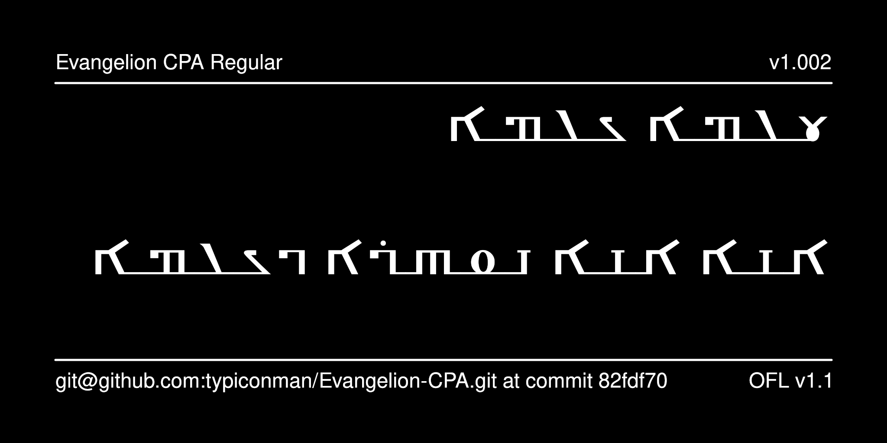

# Evangelion CPA Typeface

Evangelion CPA is a typeface for [Christian Palestinian Aramaic](https://en.wikipedia.org/wiki/Christian_Palestinian_Aramaic). The typeface is used in the [Corpus of Christian Palestinian Aramaic](https://brill.com/display/serial/CCPA).

The font is presently ALPHA-stage software and is available for testing purposes only.



## History

The font was originally designed by Shmuel Guttman (P.O.Box 13038 Jerusalem 91130) in 1992--1994. It was reencoded in Unicode and upgraded with OpenType features by Aleksandr Andreev.

## Building the Fonts

The font source is stored in a FontForge SFD file in the `sources/` directory. All modifications should be made in FontForge, resulting in an updated SFD file. This file is then converted to UFO format by running the convert script. From terminal:

```
cd your/local/project/directory
./convert.sh
```

Note that this overwrites the features.fea file. But the GSUB rules for
the attachment of glyphs are stored in this file, not in FontForge.
Therefore, the script will backup the features.fea file to ./features.fea.bak. You need to then manually add the contents of this file to the beginning
of the resulting features.fea file (before the GPOS rules).

The font can then be built using fontmake and gftools by running:

```
make build
```

Note that this requires Python and will install all of the necessary libraries and tools into a virtualenv at `venv/`.

To delete the virtualenv and the results of the build, run:

```
make clean
```

To build the sample image the sits at the top of this README, run:

```
make images
```

The commands `make update` and `make update-project-template` update the repository structure and Python dependencies and should be run periodically.

Google's master repository also had a GitHub workflow for building the fonts in the cloud on push, but this seems to always fail because of incorrect dependencies, so has been disabled. Instead, built binaries are stored on GitHub in the `fonts/` directory.

## Features

* Features will be described here.

## More Fonts

Some links will be added for Syriac fonts here.
